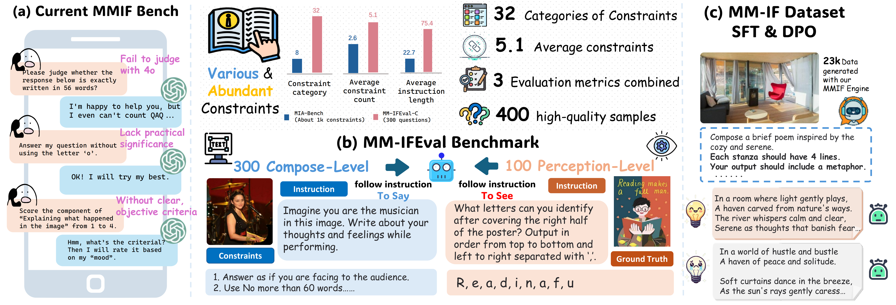
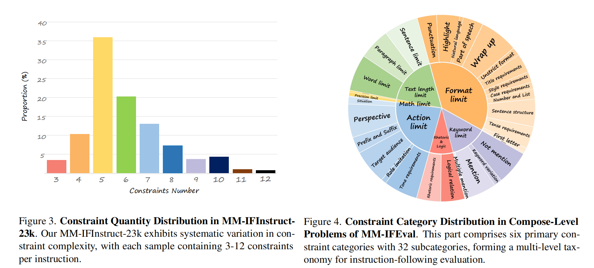
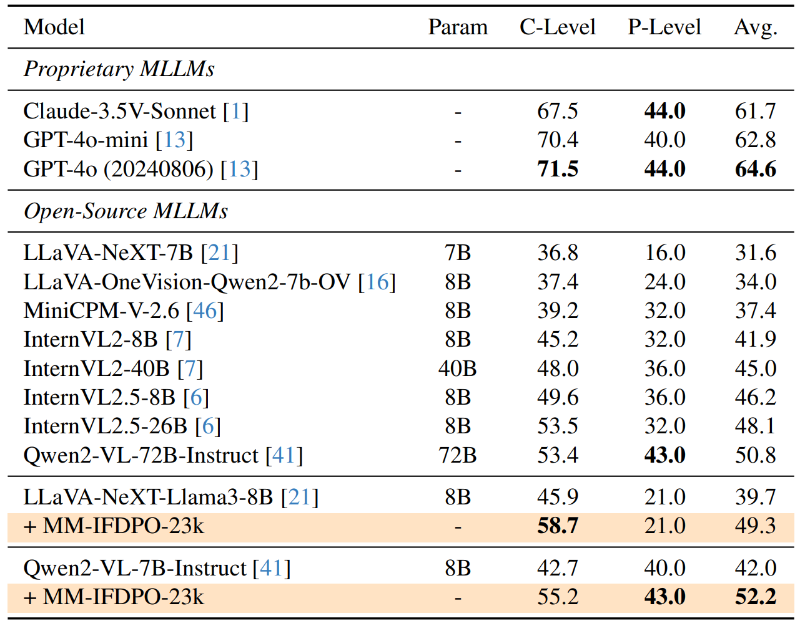

# Creation-MMBench: Assessing Context-Aware Creative Intelligence in MLLM

<div align="center">

[📃[Paper]()]
[🌐[Project Page](https://syuan03.github.io/MM-IFEngine/)]
[🤗[Hugging Face]()]
[🛠️[Evaluation](https://github.com/SYuan03/MM-IFEngine)]
</div>

<div align="center">
 
</div>

## 📣 What's New
- **[2025.3.xx]** The ProjectPage，Benchmark and Evaluation Code is all released ! 🎉🎉🎉
- **[2025.3.xx]** The MM-IFEngine Paper is released! Check it at 📃[Arxiv: MM-IFEngine]() ! Our Dataset will be open-sourced soon ! 🎉🎉🎉

## 🌟 Highlights
<div align="center">
 
</div>

1. An MM-IFEngine pipeline
for generating multimodal constraint-rich image-instruction
pairs; 
2. A large-scale training dataset MM-IFInstruct-23k
and preference optimization dataset MM-IFDPO-23k de-
rived from MM-IFEngine;
3. A challenging multimodal instruction following benchmark MM-IFEval with diverse constraints and comprehensive evaluation approaches; 
4. Empirical evidence showing significant performance gains on
both our MM-IFEval and existing benchmarks when training
MLLMs on MM-IFInstruct-23k via SFT and MM-IFDPO-23k via DPO.

## 📚 Dataset Statistics
<div align="center">
 
</div>

## 🏆 MM-IFEval Leaderboard
<div align="center">
 
</div>

Performance of existing MLLMs on MM-IFEval. We report the accuracy of easy and difficult problems and the average accuracy across all problems. The C-Level and P-Level refer to the compose-level and perception-level problems, respectively. The best performance in each section is highlighted in bold.

## 🚀 Evaluate on MM-IFEval
### 1. Environment Setup

### 2. Run Evaluation Script
```python
# Step1: finish the config below in eval_mmifeval/sh_scripts/multi_run_inf_and_score.sh
# <---- param settings ---->
PROJECT_DIR=
CONDA_ACTIVATE_PATH=
export HF_HOME=
model_bench_pairs=(
    "Qwen2-VL-7B-Instruct C-Level 8 qwen_vl HF"
    "Qwen2-VL-7B-Instruct P-Level 8 qwen_vl HF"
)
# <---- param settings ---->

# Step2: run the script
zsh eval_mmifeval/sh_scripts/multi_run_inf_and_score.sh
```


## 📝 Citation
```bibtex

```
